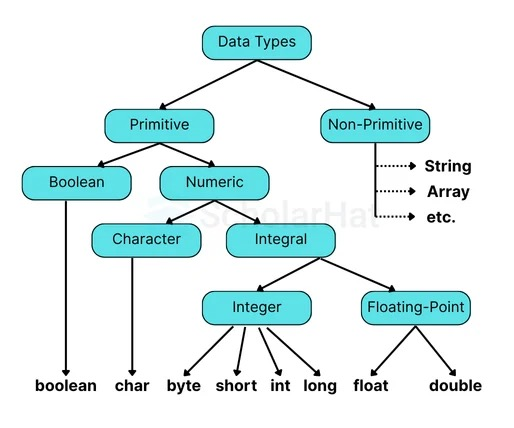

***

# ☕ Day 02 – Variables & Data Types

> *"Data is the new oil. But without variables, you have nowhere to store it."*

---

# 📋 Preview of Today's Learning

Welcome to Day 2! Today, we dive into the fundamental building blocks of every Java program: **Variables and Data Types**. 

You will learn:
- 📦 **How to store information** in your computer's memory.
- 🏷️ **The strict rules** for naming these memory locations.
- 🗂️ **The specific types of data** Java can handle.

---

# 📈 Prerequisites

Before jumping in, make sure you:
- ✔️ Have Java installed.
- ✔️ Know how to compile and run programs (`javac` and `java`).
- ✔️ Are familiar with writing a basic `Hello World` program.

---

# ⏱ Estimated Time

**1.5 – 2 Hours**

---

# 🎯 Learning Outcomes

By the end of this lesson, you will comfortably be able to:
1. Explain what a variable is to a non-programmer.
2. Declare and initialize variables properly.
3. Master Java's 8 primitive data types.
4. Differentiate between primitive and reference data types.
5. Safely convert data from one type to another (Type Casting).

---

# 🗺️ Today's Learning Journey

1. **Introduction** ➝ Why do we need Variables?
2. **Core Concepts** ➝ What is a Variable?
3. **Rules** ➝ Naming Conventions
4. **Data Types** ➝ Primitive vs Reference
5. **Literals** ➝ Hardcoding values
6. **Data Manipulation** ➝ Conversion & Casting
7. **Practice & Interview Prep**

---

# 💭 Why Should You Learn Variables?

Programs constantly work with data. Think about your favorite applications:
- 👤 A user's name
- 🎂 A user's age
- 💰 A bank balance
- 🛒 A product price

All these values need to be stored somewhere in the computer's memory so they can be calculated, updated, or displayed. 

**Variables** are the magical containers that allow us to store this information dynamically. Without them, your programs would be completely static and boring!

---

# 📖 Main Lesson

## 📦 What is a Variable?

Think of a variable as a **labeled box** used to store data. 

Instead of forcing you to remember complex computer memory addresses (like `0x1A2B`), Java lets you use simple, human-readable names to store and retrieve your data.

### 💻 Let's see some code:

```java
int age = 18;
```

**What is happening here?**
- `int` 👉 The **data type** (tells Java this box holds a whole number).
- `age` 👉 The **variable name** (the label on the box).
- `=` 👉 The **assignment operator** (puts the value into the box).
- `18` 👉 The **actual value** stored inside.

---

## 💾 Variable Declaration

Before you can use a variable, you must declare it. It's like telling Java, *"Hey, create a box for me!"*

**The Formula:**
```java
dataType variableName = value;
```

**Examples:**
```java
int studentAge = 18;
String studentName = "Nitish";
boolean isEnrolled = true;
```

---

## 📝 The Golden Rules of Naming Variables

Java is very strict about how you name your variables. If you break these rules, your code will refuse to compile!

> [!CAUTION]
> **Hard Rules (You MUST follow these):**
> - Variable names are **case-sensitive** (`age` and `Age` are totally different).
> - They must start with a letter (a-z, A-Z), an underscore (`_`), or a dollar sign (`$`).
> - They **cannot** start with a number.
> - They **cannot** contain spaces.
> - They **cannot** be reserved keywords (like `class` or `public`).

### 🎯 The "camelCase" Convention
Professional Java developers always use **camelCase**. The first word is completely lowercase, and every following word starts with a capital letter.

| Example | Valid? | Reason |
| :--- | :---: | :--- |
| `studentName` | ✅ | Perfect camelCase format. |
| `1stStudent` | ❌ | Cannot start with a number. |
| `total marks` | ❌ | Cannot contain spaces. |
| `class` | ❌ | `class` is a reserved Java keyword. |

---

## 🔢 Primitive Data Types

Java has **8 primitive data types**. These are the most basic types built directly into the language. 

Don't memorize them all at once; you'll naturally learn them as you code!

| Type | What it holds | Example |
| :--- | :--- | :--- |
| `byte` | Tiny numbers | `100` |
| `short` | Small numbers | `10000` |
| `int` | **Standard numbers** | `500` |
| `long` | Huge numbers | `999999999L` |
| `float` | Decimals | `3.14f` |
| `double`| **Precise decimals** | `3.141592` |
| `char` | A single character | `'A'` |
| `boolean`| True or False | `true` |

> [!TIP]
> **Developer Secret:** In the real world, you will use `int` for almost all whole numbers, `double` for decimals, and `boolean` for true/false. Don't stress too much about the others yet!

---

## 🏗️ Reference Data Types

Unlike primitive types, **reference data types** don't store the actual value inside the box. Instead, they store a *map* (a memory address) that points to the actual object.

**Example:**
```java
String name = "Nitish";
```

> [!IMPORTANT]
> `String` is **not** a primitive data type. It is a built-in Java Class. Notice how `String` starts with a capital **'S'**, while primitives like `int` start with lowercase letters.

---

## ✍️ What are Literals?

A **literal** is just a fancy word for a fixed, hardcoded value that you type directly into your code.

**Examples:**
- `100` (Integer literal)
- `3.14` (Double literal)
- `'A'` (Character literal — uses single quotes!)
- `"Hello"` (String literal — uses double quotes!)
- `true` (Boolean literal)

---

## 🔄 Type Conversion (Widening)

Type conversion is **automatic and completely safe**. It happens when you put a smaller data type into a larger one.

```java
int marks = 95;
double convertedMarks = marks; // Java does this automatically!

System.out.println(convertedMarks); // Output: 95.0
```

> [!NOTE]
> Because a `double` box is much bigger than an `int` box, the number fits perfectly without losing any data.

---

## 🎯 Type Casting (Narrowing)

Type casting is **manual and potentially risky**. It happens when you try to squeeze a larger data type into a smaller one.

```java
double price = 99.99;
int roundedPrice = (int) price; // You MUST manually cast it using (int)

System.out.println(roundedPrice); // Output: 99
```

> [!WARNING]
> Notice how the `.99` was completely deleted! Because data loss is possible, Java refuses to do this automatically. It forces you to type `(int)` to prove you know exactly what you are doing.

---

## 🌍 The "Water Bottle" Analogy

If Conversion and Casting still feel confusing, just think of water bottles!

🚰 **Type Conversion (Small to Large):**  
Imagine pouring water from a tiny cup into a massive jug. No water spills. It fits perfectly. Java does this safely and automatically.

🌊 **Type Casting (Large to Small):**  
Now imagine pouring that massive jug into a tiny cup. The water will overflow and spill everywhere! Because the "spilled water" (the decimals) is lost forever, Java makes you manually authorize the pour using `(dataType)`.

---

# ⚠️ Common Beginner Mistakes

- ❌ **Using `String` as a primitive:** Remember, `String` is a Class and must be capitalized!
- ❌ **Missing the `f` or `L`:** Forgetting to add `L` after long numbers (e.g., `10000000000L`) or `f` after floats (e.g., `3.14f`).
- ❌ **Quote Confusion:** Using double quotes (`"A"`) for a single `char`. 
  - Characters = Single quotes `'A'`
  - Strings = Double quotes `"Hello"`
- ❌ **Bad Naming:** Naming variables like `StudentAge`. Stick to `studentAge` (camelCase)!

---

# 🏋️ Practice Time!

### 🟢 Beginner
Create a new Java program. Declare variables to store:
- Your name
- Your age
- Your height 

Print them all to the console.

### 🟡 Intermediate
Create a **Student Profile**. Group your variables logically and use `System.out.println` statements to print a neat, formatted "profile card" to the screen.

### 🔴 Challenge
Declare variables for the following details. Your challenge is to pick the most **memory-efficient and logically correct** data type for each:
1. `Name`
2. `Age`
3. `Phone Number` *(Hint: Think about how big phone numbers are!)*
4. `Salary`
5. `Initial`
6. `isPlaced`

---

# 🎤 Interview Questions

> Ace your interviews by mastering these core concepts!

**Q: What is a variable?**
> A variable is a named memory location used to store data that can be manipulated throughout a program.

**Q: How many primitive data types are there in Java?**
> There are exactly 8: `byte`, `short`, `int`, `long`, `float`, `double`, `char`, and `boolean`.

**Q: Is `String` a primitive data type?**
> No, `String` is a reference data type. It is a built-in Java Class.

**Q: What is Type Casting and why is it necessary?**
> Type casting is the manual process of forcing a larger data type into a smaller one (e.g., `double` to `int`). It is necessary because this process can result in data loss, so Java forces the programmer to explicitly confirm the action.

---

# 📊 Summary

| Concept | Key Takeaway |
| :--- | :--- |
| **Variables** | Named boxes that store data in memory. |
| **Primitives** | 8 built-in types. The most common are `int`, `double`, and `boolean`. |
| **Reference Types** | Point to complex objects (e.g., `String`). They always start with a capital letter. |
| **camelCase** | The standard way to name variables in Java (`myVariableName`). |
| **Conversion** | Automatic and safe. No data loss. (Small → Large) |
| **Casting** | Manual and risky. Possible data loss. (Large → Small) |

---

# ⚡ Quick Revision

- ✔️ Variables store data.
- ✔️ `String` is a reference type, not a primitive.
- ✔️ Literals are hardcoded values (like `18` or `"Hello"`).
- ✔️ Conversion happens automatically.
- ✔️ Casting must be done manually using parentheses `(dataType)`.
-flowchart:

---

> *"The secret of getting ahead is getting started." — Mark Twain*

---

# ⏭️ What's Next?

Excellent work today! In **Day 03**, we will breathe life into our variables by learning about **Operators**. You will learn how to add, subtract, compare, and manipulate data to make your programs actually *do* things!

---

# 📜 License

This course is licensed under the [Creative Commons Attribution-NonCommercial 4.0 International License (CC BY-NC 4.0)](https://creativecommons.org/licenses/by-nc/4.0/).

You are free to:
- **Share** — copy and redistribute the material in any medium or format
- **Adapt** — remix, transform, and build upon the material

Under the following terms:
- **Attribution** — You must give appropriate credit, provide a link to the license, and indicate if changes were made. You may do so in any reasonable manner, but not in any way that suggests the licensor endorses you or your use.
- **NonCommercial** — You may not use the material for commercial purposes.