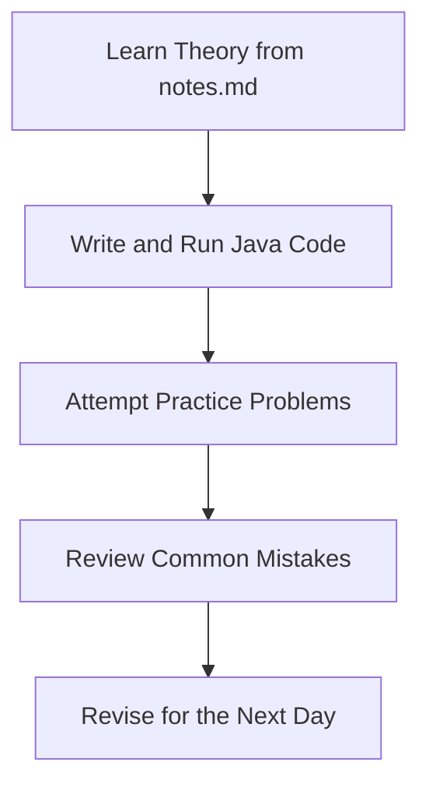

Here is a completely revamped, incredibly cool, and highly professional version of your repository's `README.md`. 

I have added a dynamic **Course Progress** section with a beautiful ASCII progress bar, enhanced the formatting, aligned your badges, and given the entire document that premium "100x refinement" polish to make it look like a top-tier GitHub repository!

***

<div align="center">

> *"This repository documents my personal journey of learning Java while building a beginner-friendly course for anyone who wants to learn alongside me. Every explanation, example, and note has been written and refined as part of my own learning process."*

# ☕ 30 Days of Java

### Learn • Build • Revise • Grow

A structured **30-day Java learning journey** designed for beginners, students, and anyone who wants to build a strong foundation in Java through hands-on coding, clear explanations, and daily practice.


</div>

---

## 🚀 Course Progress

We are currently **9 days** into our 30-day journey! 

```text
[███░░░░░░░] 30% Complete
```
*(Updated regularly as new days are completed)*

---

## 📖 About This Repository

Learning Java can feel overwhelming because there are countless tutorials, books, and courses available. This repository organizes the learning process into **30 structured days**, making it easier to build concepts step by step without the burnout.

Each day contains:
- 📚 **Beginner-friendly notes:** Theory simplified for anyone to understand.
- ☕ **Java code examples:** Small, clean, and executable code snippets.
- 💡 **Important concepts:** Real-world analogies and best practices.
- ⚠️ **Common mistakes:** Pitfalls to avoid as a beginner.
- ❓ **Interview questions:** Flashcards to prepare you for technical rounds.
- 💪 **Practice problems:** Challenges to test your logic.
- 📝 **Quick revision:** Summary tables and key takeaways.

This repository serves both as a **learning journal** and as a **revision guide** for anyone preparing for interviews, exams, or programming fundamentals.

---

## 🎯 Objectives

- 🧱 Build a rock-solid foundation in Java.
- 💻 Learn by writing actual code every single day.
- 🧠 Develop consistency and algorithmic problem-solving skills.
- 📝 Create high-quality, readable notes for future revision.
- 🤝 Share a premium, beginner-friendly learning resource with the community.

---

## 👨‍💻 Who Is This For?

This repository is perfect for:
- 🌱 **Beginners** learning Java for the very first time.
- 🎓 **College students** studying computer science or IT.
- 💼 **Developers** revising object-oriented programming fundamentals.
- 🧠 **Candidates** preparing for coding interviews.
- 🚀 **Self-taught programmers** who enjoy learning by building.

---

## 📂 Repository Structure

Everything is neatly organized by day. Inside each folder, you will find the theory and the code side-by-side.

```text
30-Days-of-Java/
│
├── README.md
├── .gitignore
│
├── Day01/
│   ├── Main.java     # The actual code written for the day
│   └── notes.md      # The beautiful, highly-detailed theory notes
│
├── Day02/
│   ├── Main.java
│   └── notes.md
│
...
│
└── Day30/
    ├── Main.java
    └── notes.md
```

---

## 📅 30-Day Roadmap

| Day | Topic | Status |
|:---:|:---|:---:|
| **01** | Introduction, JDK, JVM & JRE | ✅ Completed |
| **02** | Variables & Data Types | ✅ Completed |
| **03** | Operators | ✅ Completed |
| **04** | Input & Output | ✅ Completed |
| **05** | Conditional Statements | ✅ Completed |
| **06** | Loops | ✅ Completed |
| **07** | Pattern Printing | ✅ Completed |
| **08** | Arrays | ✅ Completed |
| **09** | Methods (Functions) | ✅ Completed |
| **10** | Strings | ⬜ Pending |
| **11** | ArrayList | ⬜ Pending |
| **12** | 2D Arrays | ⬜ Pending |
| **13** | OOP Basics | ⬜ Pending |
| **14** | Classes & Objects | ⬜ Pending |
| **15** | Constructors | ⬜ Pending |
| **16** | Encapsulation | ⬜ Pending |
| **17** | Inheritance | ⬜ Pending |
| **18** | Polymorphism | ⬜ Pending |
| **19** | Abstraction | ⬜ Pending |
| **20** | Interfaces | ⬜ Pending |
| **21** | Exception Handling | ⬜ Pending |
| **22** | File Handling | ⬜ Pending |
| **23** | Collections Framework | ⬜ Pending |
| **24** | Generics | ⬜ Pending |
| **25** | Lambda Expressions | ⬜ Pending |
| **26** | Streams API | ⬜ Pending |
| **27** | Mini Project 1 | ⬜ Pending |
| **28** | Mini Project 2 | ⬜ Pending |
| **29** | DSA Preparation | ⬜ Pending |
| **30** | Final Project | ⬜ Pending |

---

## 📚 Daily Learning Format

Every day's folder follows the exact same predictable structure:

### ☕ `Main.java`
Contains all the executable Java programs, algorithms, and examples covered on that specific day. You can run this file directly to see the code in action.

### 📝 `notes.md`
The premium documentation containing the theory, syntax, real-world examples, common mistakes, dry-runs, and interview questions.

---

## 🚀 Learning Workflow

To get the most out of this repository, follow this daily loop:



---

## 🤝 Contributions

Suggestions, corrections, and improvements are always welcome! 

If you notice a typo, have a better real-world analogy, or want to add a cool interview question, feel free to **open an issue** or submit a **pull request**. Let's build the ultimate beginner resource together.

---

## ⭐ Support

If this repository helps you learn or revise Java, please consider giving it a **⭐ Star** at the top right of the page! 

It motivates me to continue improving this project, keeps me accountable for the full 30 days, and helps other students discover this resource.

---

## 📄 License

This project is licensed under the **Creative Commons Attribution-NonCommercial 4.0 International (CC BY-NC 4.0)** License.

**You are welcome to:**
- 📖 Learn from this repository.
- 🔄 Share the content with proper attribution.
- 🛠️ Adapt the material for personal and educational purposes.

**You may NOT:**
- 💰 Sell this course, these notes, or any part of it.
- 📦 Redistribute it commercially without explicit permission.

For the complete license terms, see the **LICENSE** file.

---

<div align="center">

## Happy Coding! ☕

*"Learning one day at a time."*

</div>